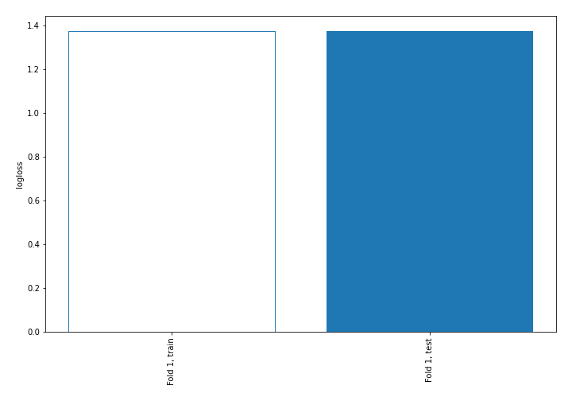
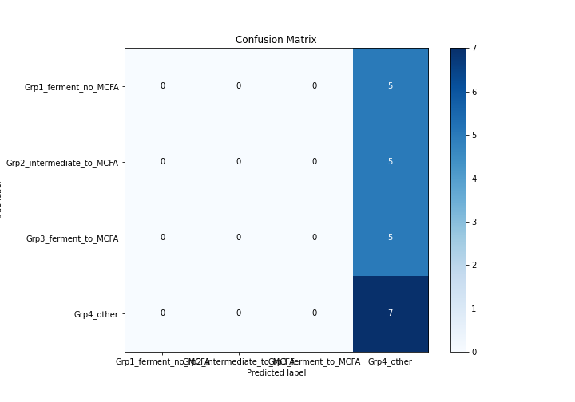
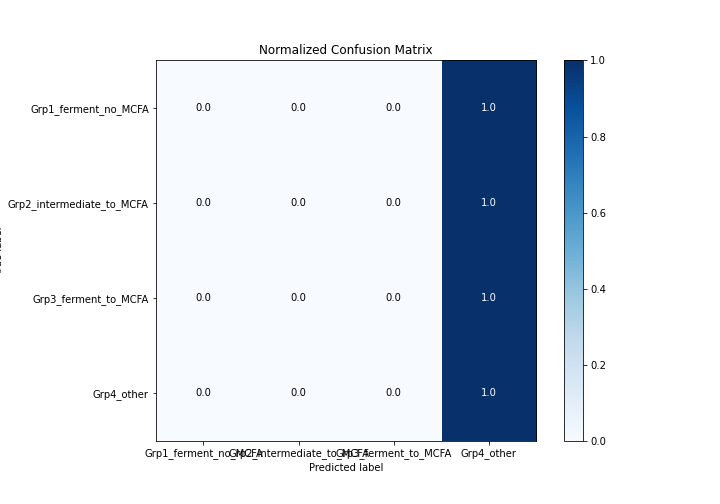
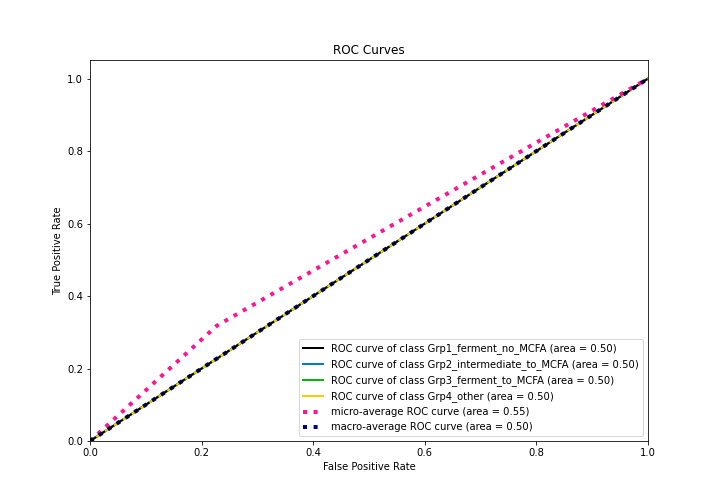
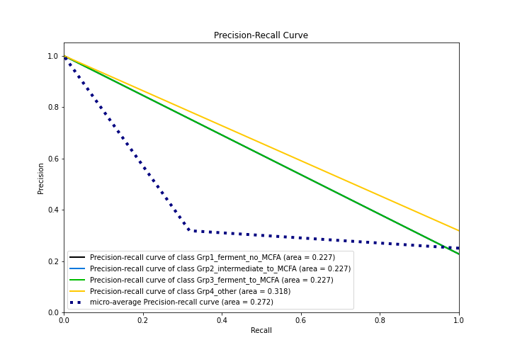

# Summary of 1_Baseline

[<< Go back](../README.md)

## Baseline Classifier (Baseline)
- **n_jobs**: -1
- **num_class**: 4
- **explain_level**: 2

## Validation
 - **validation_type**: split
 - **train_ratio**: 0.75
 - **shuffle**: True
 - **stratify**: True

## Optimized metric
logloss

## Training time

0.3 seconds

### Metric details
|           |   Grp1_ferment_no_MCFA |   Grp2_intermediate_to_MCFA |   Grp3_ferment_to_MCFA |   Grp4_other |   accuracy |   macro avg |   weighted avg |   logloss |
|:----------|-----------------------:|----------------------------:|-----------------------:|-------------:|-----------:|------------:|---------------:|----------:|
| precision |                      0 |                           0 |                      0 |     0.318182 |   0.318182 |   0.0795455 |       0.10124  |   1.37455 |
| recall    |                      0 |                           0 |                      0 |     1        |   0.318182 |   0.25      |       0.318182 |   1.37455 |
| f1-score  |                      0 |                           0 |                      0 |     0.482759 |   0.318182 |   0.12069   |       0.153605 |   1.37455 |
| support   |                      5 |                           5 |                      5 |     7        |   0.318182 |  22         |      22        |   1.37455 |

## Confusion matrix
|                                      |   Predicted as Grp1_ferment_no_MCFA |   Predicted as Grp2_intermediate_to_MCFA |   Predicted as Grp3_ferment_to_MCFA |   Predicted as Grp4_other |
|:-------------------------------------|------------------------------------:|-----------------------------------------:|------------------------------------:|--------------------------:|
| Labeled as Grp1_ferment_no_MCFA      |                                   0 |                                        0 |                                   0 |                         5 |
| Labeled as Grp2_intermediate_to_MCFA |                                   0 |                                        0 |                                   0 |                         5 |
| Labeled as Grp3_ferment_to_MCFA      |                                   0 |                                        0 |                                   0 |                         5 |
| Labeled as Grp4_other                |                                   0 |                                        0 |                                   0 |                         7 |

## Learning curves

## Confusion Matrix

## Normalized Confusion Matrix

## ROC Curve

## Precision Recall Curve

[<< Go back](../README.md)
