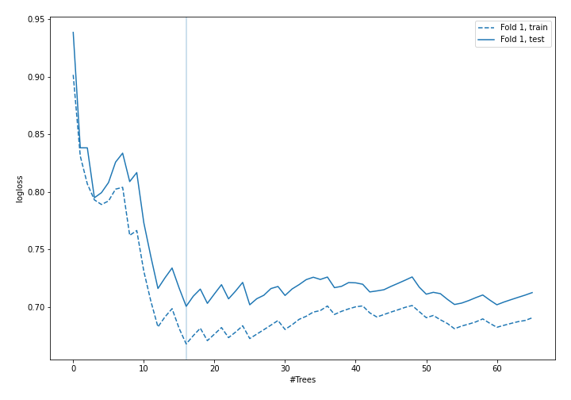
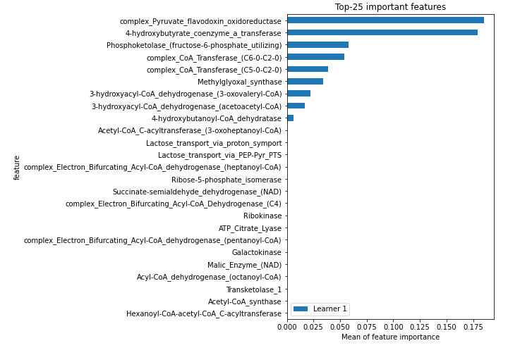
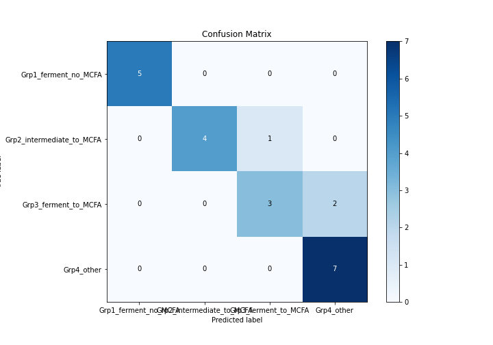
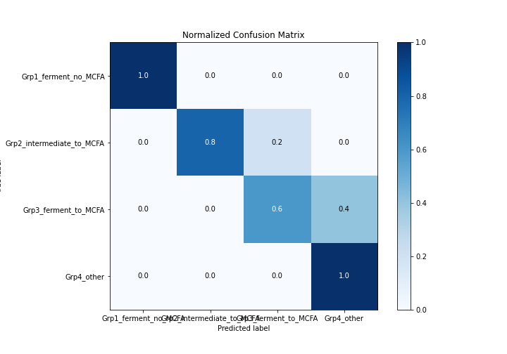
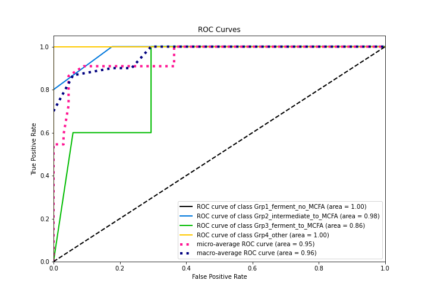
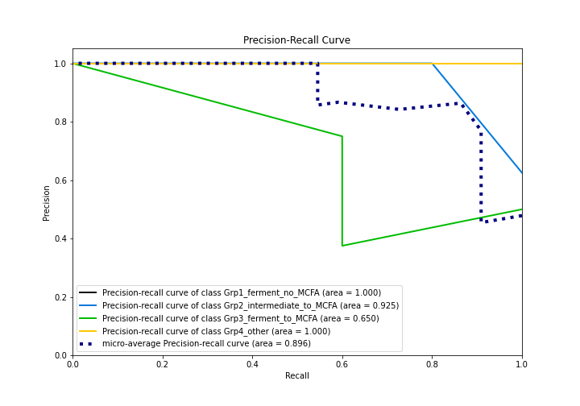
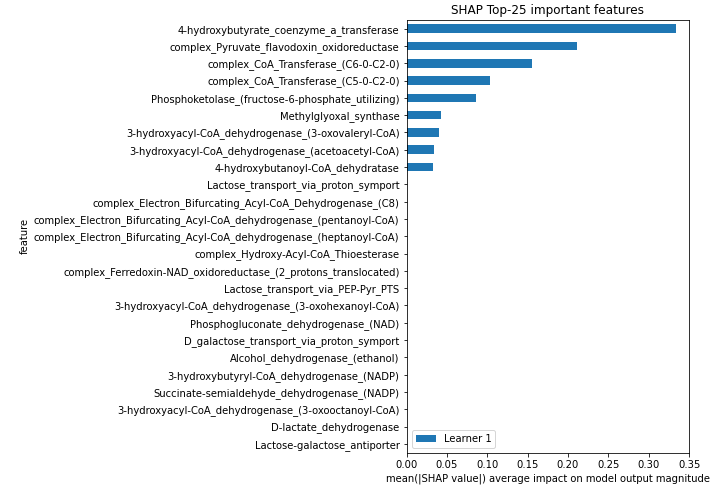
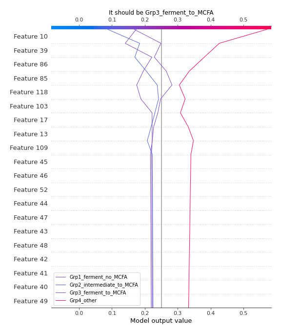
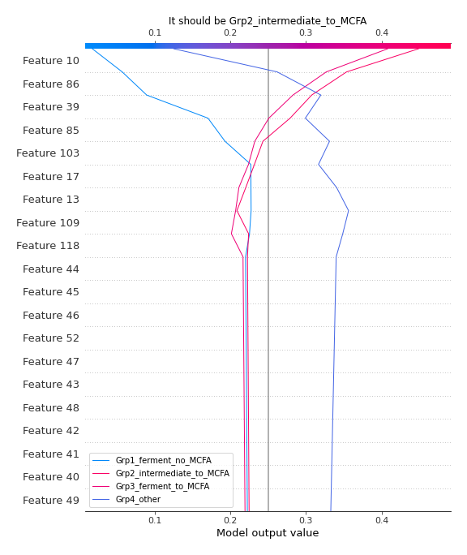
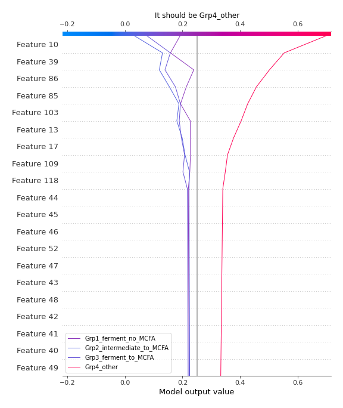

# Summary of 8_Default_RandomForest

[<< Go back](../README.md)

## Random Forest
- **n_jobs**: -1
- **criterion**: gini
- **max_features**: 0.9
- **min_samples_split**: 30
- **max_depth**: 4
- **eval_metric_name**: logloss
- **num_class**: 4
- **explain_level**: 2

## Validation
 - **validation_type**: split
 - **train_ratio**: 0.75
 - **shuffle**: True
 - **stratify**: True

## Optimized metric
logloss

## Training time

9.2 seconds

### Metric details
|           |   Grp1_ferment_no_MCFA |   Grp2_intermediate_to_MCFA |   Grp3_ferment_to_MCFA |   Grp4_other |   accuracy |   macro avg |   weighted avg |   logloss |
|:----------|-----------------------:|----------------------------:|-----------------------:|-------------:|-----------:|------------:|---------------:|----------:|
| precision |                      1 |                    1        |               0.75     |     0.777778 |   0.863636 |    0.881944 |       0.872475 |   0.70066 |
| recall    |                      1 |                    0.8      |               0.6      |     1        |   0.863636 |    0.85     |       0.863636 |   0.70066 |
| f1-score  |                      1 |                    0.888889 |               0.666667 |     0.875    |   0.863636 |    0.857639 |       0.859217 |   0.70066 |
| support   |                      5 |                    5        |               5        |     7        |   0.863636 |   22        |      22        |   0.70066 |

## Confusion matrix
|                                      |   Predicted as Grp1_ferment_no_MCFA |   Predicted as Grp2_intermediate_to_MCFA |   Predicted as Grp3_ferment_to_MCFA |   Predicted as Grp4_other |
|:-------------------------------------|------------------------------------:|-----------------------------------------:|------------------------------------:|--------------------------:|
| Labeled as Grp1_ferment_no_MCFA      |                                   5 |                                        0 |                                   0 |                         0 |
| Labeled as Grp2_intermediate_to_MCFA |                                   0 |                                        4 |                                   1 |                         0 |
| Labeled as Grp3_ferment_to_MCFA      |                                   0 |                                        0 |                                   3 |                         2 |
| Labeled as Grp4_other                |                                   0 |                                        0 |                                   0 |                         7 |

## Learning curves

## Permutation-based Importance

## Confusion Matrix

## Normalized Confusion Matrix

## ROC Curve

## Precision Recall Curve

## SHAP Importance

## SHAP Dependence plots

## SHAP Decision plots

### Worst decisions for selected sample 1 (Fold 1)

### Worst decisions for selected sample 2 (Fold 1)

### Worst decisions for selected sample 3 (Fold 1)

### Worst decisions for selected sample 4 (Fold 1)

### Best decisions for selected sample 1 (Fold 1)

### Best decisions for selected sample 2 (Fold 1)

### Best decisions for selected sample 3 (Fold 1)

### Best decisions for selected sample 4 (Fold 1)

[<< Go back](../README.md)
