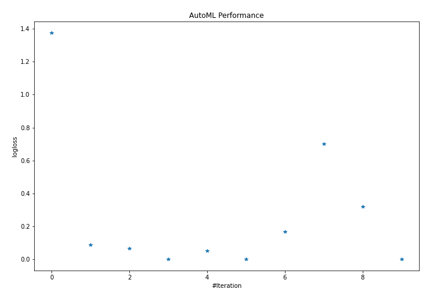
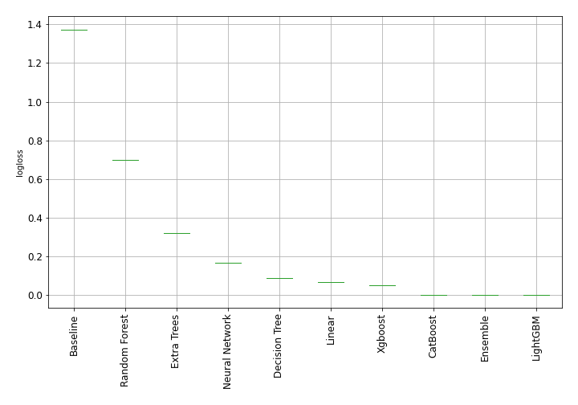
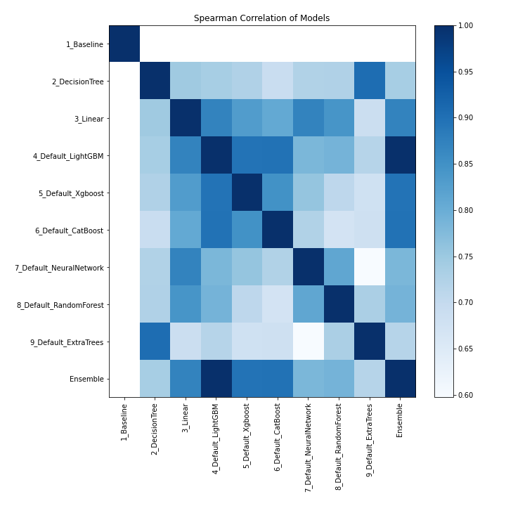

# AutoML Leaderboard

| Best model   | name                                                         | model_type     | metric_type   |   metric_value |   train_time |
|:-------------|:-------------------------------------------------------------|:---------------|:--------------|---------------:|-------------:|
|              | [1_Baseline](1_Baseline/README.md)                           | Baseline       | logloss       |     1.37455    |         0.59 |
|              | [2_DecisionTree](2_DecisionTree/README.md)                   | Decision Tree  | logloss       |     0.0888997  |        19.75 |
|              | [3_Linear](3_Linear/README.md)                               | Linear         | logloss       |     0.0663769  |         7.6  |
| **the best** | [4_Default_LightGBM](4_Default_LightGBM/README.md)           | LightGBM       | logloss       |     0.00121498 |        10.16 |
|              | [5_Default_Xgboost](5_Default_Xgboost/README.md)             | Xgboost        | logloss       |     0.0515309  |         9.51 |
|              | [6_Default_CatBoost](6_Default_CatBoost/README.md)           | CatBoost       | logloss       |     0.00212401 |        25.4  |
|              | [7_Default_NeuralNetwork](7_Default_NeuralNetwork/README.md) | Neural Network | logloss       |     0.166366   |         1.86 |
|              | [8_Default_RandomForest](8_Default_RandomForest/README.md)   | Random Forest  | logloss       |     0.70066    |         9.87 |
|              | [9_Default_ExtraTrees](9_Default_ExtraTrees/README.md)       | Extra Trees    | logloss       |     0.31948    |        17.11 |
|              | [Ensemble](Ensemble/README.md)                               | Ensemble       | logloss       |     0.00121498 |         0.3  |

### AutoML Performance

### AutoML Performance Boxplot

### Features Importance

### Spearman Correlation of Models

