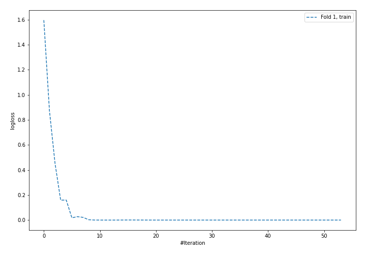
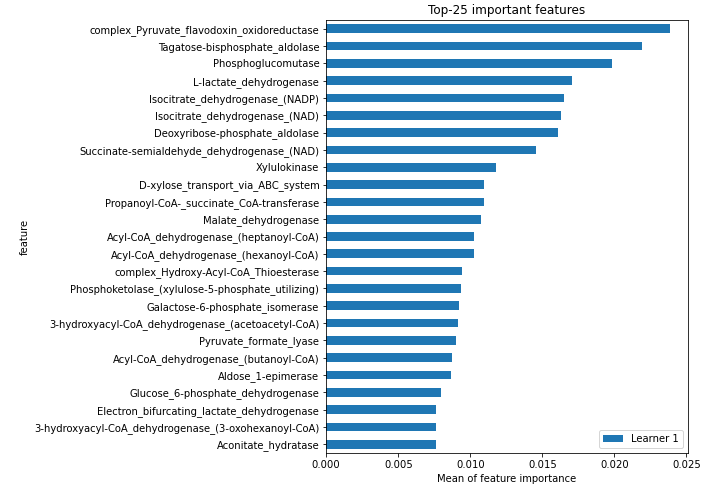
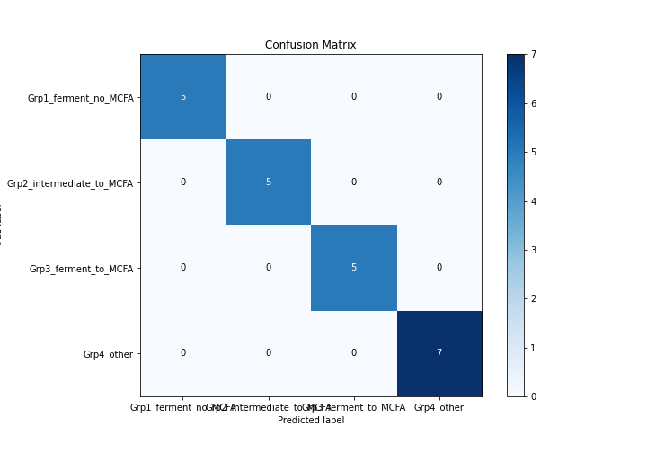
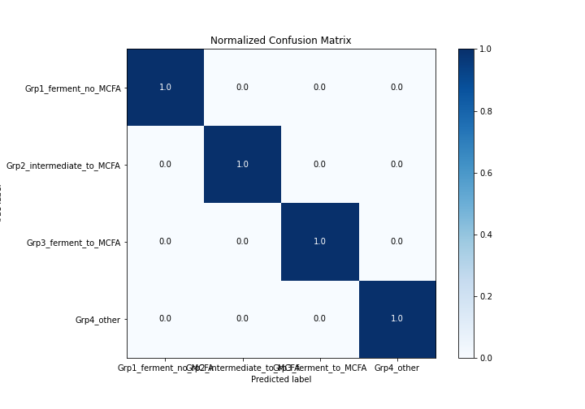
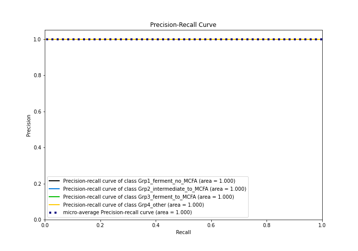

# Summary of 7_Default_NeuralNetwork

[<< Go back](../README.md)

## Neural Network
- **n_jobs**: -1
- **dense_1_size**: 32
- **dense_2_size**: 16
- **learning_rate**: 0.05
- **num_class**: 4
- **explain_level**: 2

## Validation
 - **validation_type**: split
 - **train_ratio**: 0.75
 - **shuffle**: True
 - **stratify**: True

## Optimized metric
logloss

## Training time

1.4 seconds

### Metric details
|           |   Grp1_ferment_no_MCFA |   Grp2_intermediate_to_MCFA |   Grp3_ferment_to_MCFA |   Grp4_other |   accuracy |   macro avg |   weighted avg |   logloss |
|:----------|-----------------------:|----------------------------:|-----------------------:|-------------:|-----------:|------------:|---------------:|----------:|
| precision |                      1 |                           1 |                      1 |            1 |          1 |           1 |              1 |  0.166366 |
| recall    |                      1 |                           1 |                      1 |            1 |          1 |           1 |              1 |  0.166366 |
| f1-score  |                      1 |                           1 |                      1 |            1 |          1 |           1 |              1 |  0.166366 |
| support   |                      5 |                           5 |                      5 |            7 |          1 |          22 |             22 |  0.166366 |

## Confusion matrix
|                                      |   Predicted as Grp1_ferment_no_MCFA |   Predicted as Grp2_intermediate_to_MCFA |   Predicted as Grp3_ferment_to_MCFA |   Predicted as Grp4_other |
|:-------------------------------------|------------------------------------:|-----------------------------------------:|------------------------------------:|--------------------------:|
| Labeled as Grp1_ferment_no_MCFA      |                                   5 |                                        0 |                                   0 |                         0 |
| Labeled as Grp2_intermediate_to_MCFA |                                   0 |                                        5 |                                   0 |                         0 |
| Labeled as Grp3_ferment_to_MCFA      |                                   0 |                                        0 |                                   5 |                         0 |
| Labeled as Grp4_other                |                                   0 |                                        0 |                                   0 |                         7 |

## Learning curves

## Permutation-based Importance

## Confusion Matrix

## Normalized Confusion Matrix

## ROC Curve

## Precision Recall Curve

[<< Go back](../README.md)
